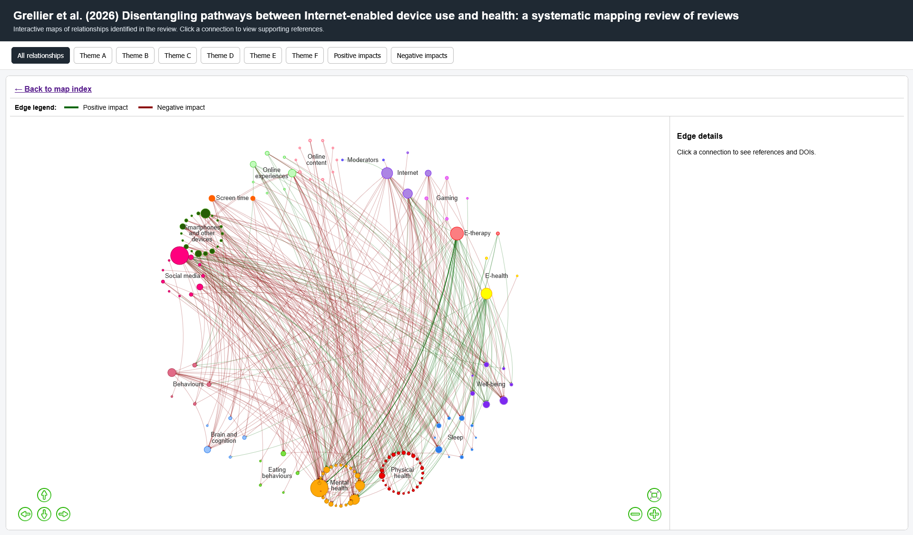

# Disentangling pathways between Internet-enabled device use and health: a systematic mapping review of reviews - Systems map

## Overview

This repository contains an interactive systems map of relationships identified in a systematic mapping review of reviews examining the health impacts of internet-enabled technologies and online activities (Figure 1).

The visualisation was originally developed in Kumu and subsequently recreated using R and HTML to provide a fully reproducible, platform-independent, and archivable version of the map.

The interactive maps allow users to explore relationships between exposures, outcomes, moderators, and other concepts identified in the review, together with the supporting references from the evidence base.

Figure 1

## Contents

### Interactive maps

The repository contains a series of interactive HTML maps, including:

* Complete map of all identified relationships
* Theme-specific maps
* Positive-impact relationships only
* Negative-impact relationships only

Each map allows users to:

* Explore relationships between concepts
* View supporting references for individual connections
* Navigate between thematic subsets of the evidence base

The main entry point is:

`index.html`

### Source data

The repository includes the source data used to generate the maps:

* `Elements.csv`
* `Connections.csv`

Additional processed data files may include:

* `nodes_with_coords_sized.csv`
* `edges_collapsed.csv`

### Code

The repository includes R scripts used to:

* Process source data
* Generate node coordinates
* Create interactive visNetwork visualisations
* Export standalone HTML maps

## Reproducibility

All visualisations were generated using open-source software, principally:

* R
* tidyverse
* visNetwork
* htmltools

The intention is to provide a long-term, reproducible alternative to proprietary online visualisation platforms.

## Version

Version 0.9

## Citation

If you use these materials, please cite the associated publication:

[INSERT FULL CITATION HERE]

Archived version of this repository:

DOI: [INSERT ZENODO DOI HERE]

## Licensing

### Code

All code in this repository is released under the MIT License.

### Data

All data in this repository are released under the Creative Commons Attribution 4.0 International (CC BY 4.0) licence unless otherwise stated.

## Author

Dr James Grellier
European Centre for Environment and Human Health
University of Exeter
United Kingdom

## Contact

For questions regarding the map, source data, or associated publication, please contact the repository author.
